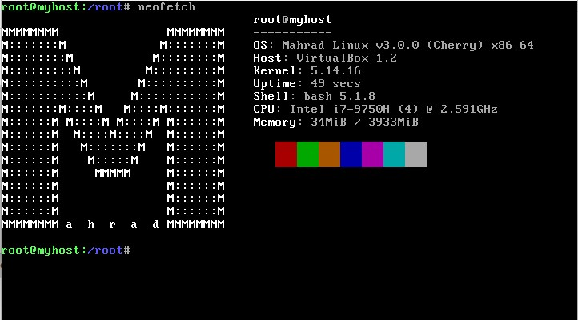

Mahrad Linux
===============================

A simple linux distro for those who are eager to explore the linux's world.
this distro is made based on the tutorial provided by [linux from scratch](https://www.linuxfromscratch.org/lfs/view/systemd/) and aims to be easy to use. it also includes some essential packages from [beyond linux from scratch](https://www.linuxfromscratch.org/blfs/view/stable/) and minor tweaks.

# Features 
- The whole system is available as a single ready-to-attach `vdi` file.
- x86_64 architecture
- Systemd init system.
- 4GB swap
- 2 kernels are included by default (5.14.16 and 5.15)
- `motd`
- Extra packages such as:
  - Lynx (cli web browser)
  - Brew (userside package manager, available in brewed edition) 
  - UnZip
  - Git
  - Ssh
  - Nano
  - Curl
  - Wget
  - Tmux
  - Tree
  - Which
  - Neofetch
  - Dash
  - etc.
# How to use?

1. Download the latest version from [Gdrive](https://drive.google.com/drive/folders/1w7UkEwesqA_RNcZOSk3PAZ6C9UMm2fiy?usp=sharing).
2. Extract it
3. Create new virtual machine using virtual box
5. Set `Type` to `Linux`
6. Set `Version` to `Linux 2.6 / 3.x / 4.x (64 bit)`
7. In `Hard disk` section choose `use an existing virtual hard disk file`
8. Select `Mahrad Linux.vdi`
9. Next..next...
10. Start the machine
11. Username:`root` password:1234 (`cherry` username is available in brewed version and the password is the same)
12. Have fun :)

